# CramWise — Complete Repository Audit & Implementation Plan

> **Audit Date:** 2026-08-25  
> **Source of Truth:** Actual source code inspection of every file in the repository  
> **Status:** Awaiting your approval before any code changes

---

## 1. Current Architecture Diagram

```mermaid
graph TB
    subgraph Frontend["Frontend (React + Vite, port 5173)"]
        FE_App["App (main.jsx — 2644 lines, single file)"]
        FE_Upload["UploadContent"]
        FE_Dashboard["Dashboard"]
        FE_Subjects["Subjects"]
        FE_Analytics["Analytics"]
        FE_StudyPlan["StudyPlan"]
        FE_PYQs["PYQs"]
        FE_Chat["Chat"]
        FE_TopicDrawer["TopicDrawer"]
    end

    subgraph API["FastAPI (port 8000)"]
        R_Upload["POST /upload/syllabus"]
        R_PYQ["POST /upload/pyq"]
        R_Notes["POST /api/notes/upload"]
        R_Root["GET /"]
        R_Health["GET /health"]
    end

    subgraph Services["Backend Services (exist but NO HTTP endpoints)"]
        S_SyllPipeline["SyllabusPipelineService"]
        S_SyllParser["SyllabusParser"]
        S_TopicService["SyllabusTopicService"]
        S_IndexBuilder["SyllabusIndexBuilder"]
        S_OCRmyPDF["OCRmyPDFClient"]
        S_OCRClient["OCRClient (Ollama)"]
        S_PaperGrouper["PaperGrouper"]
        S_PaperStorage["PaperStorage"]
        S_PaperTextBuilder["PaperTextBuilder"]
        S_QuestionParser["QuestionParser"]
        S_QuestionValidator["QuestionOutputValidator"]
        S_QuestionEnricher["QuestionEnrichmentService"]
        S_M3_Analysis["QuestionAnalysisService (M3)"]
        S_M5_Analytics["M5 Analytics Suite"]
        S_M65["M65TopicExplanationService"]
        S_M63["M6PersonalizedRecommendationService"]
        S_Cognee["CogneeService"]
        S_Groq["GroqClient"]
    end

    subgraph Storage["File System Storage"]
        FS_Syllabus["uploads/syllabus/*.pdf"]
        FS_PYQ["uploads/pyqs/*.pdf"]
        FS_Notes["uploads/notes/{code}/{id}/*.pdf"]
        FS_SyllRaw["uploads/temp/syllabus/syllabus_raw.json"]
        FS_SyllStruct["uploads/temp/syllabus/syllabus_structure.json"]
        FS_SyllIndex["uploads/temp/syllabus/syllabus_index.json"]
        FS_Papers["uploads/temp/papers/{doc}/papers.json"]
        FS_Parsed["uploads/temp/parsed/{doc}/*_questions.json"]
        FS_Enriched["uploads/temp/enriched/{doc}/*_questions.json"]
        FS_Analytics["uploads/temp/analytics/{doc}/*.json"]
        FS_Cognee["data/cognee/ (LanceDB)"]
    end

    FE_App -->|"GET /"| R_Root
    FE_Upload -->|"POST multipart"| R_Upload
    FE_Upload -->|"POST multipart"| R_PYQ
    FE_Upload -->|"POST multipart"| R_Notes

    R_Upload --> S_SyllPipeline
    S_SyllPipeline --> S_OCRmyPDF
    S_SyllPipeline --> S_SyllParser
    S_SyllParser --> S_Groq
    R_PYQ -->|"saves only"| FS_PYQ
    R_Notes -->|"saves + metadata"| FS_Notes

    FE_Dashboard -.->|"HARDCODED mock"| FE_Dashboard
    FE_Subjects -.->|"HARDCODED mock"| FE_Subjects
    FE_Analytics -.->|"HARDCODED mock"| FE_Analytics
    FE_TopicDrawer -.->|"NO M6.5 call"| FE_TopicDrawer
    FE_Chat -.->|"NO backend"| FE_Chat
```



---

## 2. End-to-End Data Flow

```mermaid
graph LR
    A["Student uploads PDF"] --> B["FastAPI saves to disk"]
    B -->|"Syllabus only"| C["OCRmyPDF → Searchable PDF"]
    C --> D["SyllabusParser (PyMuPDF + Groq)"]
    D --> E["syllabus_raw.json"]
    E -->|"MANUAL"| F["SyllabusTopicService → syllabus_structure.json"]
    F -->|"MANUAL"| G["SyllabusIndexBuilder → syllabus_index.json"]

    B -->|"PYQ — MANUAL"| H["PDFToImages → Ollama OCR"]
    H --> I["MetadataExtractor + PaperGrouper → papers.json"]
    I --> J["PaperTextBuilder + QuestionParser → parsed questions"]
    J --> K["QuestionEnrichmentService → enriched questions"]
    K -->|"MANUAL"| L["M3 QuestionAnalysis → topic mapping"]
    L -->|"MANUAL"| M["M5 Analytics → priority/importance/dependency"]

    G --> N["M6.5 TopicExplanation"]
    M --> N
    O["Notes → Cognee (MANUAL)"] --> N
    N --> P["Groq → Teaching explanation"]

    M -->|"MANUAL"| Q["M6.3 Recommendations → Study Plan"]

    style B fill:#e74c3c,color:white
    style E fill:#f39c12,color:white
    style F fill:#f39c12,color:white
    style G fill:#f39c12,color:white
    style H fill:#f39c12,color:white
    style K fill:#f39c12,color:white
    style L fill:#f39c12,color:white
    style M fill:#f39c12,color:white
    style O fill:#f39c12,color:white
```



> 🔴 Red = API endpoint exists but incomplete  
> 🟠 Orange = Manual/script-only step (not automated)

---

## 3. Backend Component Map

| Component | File | Purpose | Called By | Status |
|-----------|------|---------|-----------|--------|
| **FastAPI App** | [main.py](file:///c:/Users/vaish/CramWise_vaishi/backend/app/main.py) | Entry point, registers routers, CORS middleware | Uvicorn | ✅ Working (CORS configured) |
| **Upload Router** | [upload.py](file:///c:/Users/vaish/CramWise_vaishi/backend/app/routers/upload.py) | `/upload/syllabus`, `/upload/pyq` | Frontend | ⚠️ Syllabus runs pipeline; PYQ saves only |
| **Notes Router** | [notes.py](file:///c:/Users/vaish/CramWise_vaishi/backend/app/routers/notes.py) | `/api/notes/upload` | Frontend | ⚠️ Saves files, no Cognee ingestion |
| **UploadService** | [upload_service.py](file:///c:/Users/vaish/CramWise_vaishi/backend/app/services/upload_service.py) | File save helper | Routers | ✅ Working |
| **SyllabusPipelineService** | [syllabus_pipeline_service.py](file:///c:/Users/vaish/CramWise_vaishi/backend/app/services/syllabus_pipeline_service.py) | OCR + Parse orchestrator | Upload router | ⚠️ Runs synchronously in request handler |
| **OCRmyPDFClient** | [ocrmypdf_client.py](file:///c:/Users/vaish/CramWise_vaishi/backend/app/extraction/ocrmypdf_client.py) | Tesseract OCR wrapper | SyllabusPipeline | ✅ Working, caches `_ocr.pdf` |
| **SyllabusParser** | [syllabus_parser.py](file:///c:/Users/vaish/CramWise_vaishi/backend/app/parsers/syllabus_parser.py) | PDF → courses/units via LLM | SyllabusPipeline | ⚠️ Chunk boundary issues |
| **SyllabusTopicService** | [syllabus_topic_service.py](file:///c:/Users/vaish/CramWise_vaishi/backend/app/services/syllabus_topic_service.py) | LLM topic structuring | Scripts only | ❌ Manual only |
| **SyllabusIndexBuilder** | [syllabus_index_builder.py](file:///c:/Users/vaish/CramWise_vaishi/backend/app/services/syllabus_index_builder.py) | Flat index builder | Scripts only | ❌ Manual only |
| **SyllabusStructureValidator** | [syllabus_structure_validator.py](file:///c:/Users/vaish/CramWise_vaishi/backend/app/validators/syllabus/syllabus_structure_validator.py) | Structure validation | Scripts only | ✅ Working |
| **OCRClient (Ollama)** | [ocr_client.py](file:///c:/Users/vaish/CramWise_vaishi/backend/app/extraction/ocr_client.py) | Vision OCR for PYQs | PYQ scripts | ✅ Working (with caching) |
| **PDFToImages** | [pdf_to_images.py](file:///c:/Users/vaish/CramWise_vaishi/backend/app/extraction/pdf_to_images.py) | PDF → JPEG pages | PYQ scripts | ✅ Working |
| **TextCleaner** | [text_cleaner.py](file:///c:/Users/vaish/CramWise_vaishi/backend/app/extraction/text_cleaner.py) | OCR text cleanup | OCRClient | ✅ Working |
| **MetadataExtractor** | [metadata_extractor.py](file:///c:/Users/vaish/CramWise_vaishi/backend/app/parsers/metadata_extractor.py) | Regex exam metadata | PaperGrouper | ⚠️ Rigid regex patterns |
| **PaperGrouper** | [paper_grouper.py](file:///c:/Users/vaish/CramWise_vaishi/backend/app/parsers/paper_grouper.py) | Page → paper grouping | PYQ scripts | ⚠️ Assumes sequential headers |
| **PaperStorage** | [paper_storage.py](file:///c:/Users/vaish/CramWise_vaishi/backend/app/services/paper_storage.py) | papers.json persistence | PYQ scripts | ✅ Working |
| **PaperTextBuilder** | [paper_text_builder.py](file:///c:/Users/vaish/CramWise_vaishi/backend/app/services/paper_text_builder.py) | Multi-page text assembly | PaperQuestionParser | ✅ Working |
| **QuestionParser** | [question_parser.py](file:///c:/Users/vaish/CramWise_vaishi/backend/app/parsers/question_parser.py) | LLM question extraction | PaperQuestionParser | 🔴 **BROKEN** — import error |
| **QuestionOutputValidator** | [question_output_validator.py](file:///c:/Users/vaish/CramWise_vaishi/backend/app/validators/question_output_validator.py) | Question structure validation | QuestionParser | ⚠️ Overly strict rules |
| **ParserClient** | [parser_client.py](file:///c:/Users/vaish/CramWise_vaishi/backend/app/parsers/parser_client.py) | Groq LLM wrapper for parsing | QuestionParser, SyllabusParser | ✅ Working |
| **QuestionEnricher** | [question_enricher.py](file:///c:/Users/vaish/CramWise_vaishi/backend/app/services/question_enricher.py) | Adds unit/marks metadata | Scripts only | ⚠️ Hardcoded mappings |
| **QuestionEnrichmentService** | [question_enrichment_service.py](file:///c:/Users/vaish/CramWise_vaishi/backend/app/services/question_enrichment_service.py) | Enriches full paper | Scripts only | ⚠️ Fails on unknown mappings |
| **M3 QuestionAnalysisService** | [question_analysis_service.py](file:///c:/Users/vaish/CramWise_vaishi/backend/app/services/llm_analysis/question_analysis_service.py) | Question → syllabus topic mapping | Scripts only | ❌ Manual only |
| **M5 Analytics Suite** | [academic_analytics/](file:///c:/Users/vaish/CramWise_vaishi/backend/app/services/academic_analytics) | Importance, dependency, priority | Scripts only | ❌ Manual only |
| **M6.5 TopicExplanation** | [topic_explanation_service.py](file:///c:/Users/vaish/CramWise_vaishi/backend/app/services/m6_5/topic_explanation_service.py) | Cognee + PYQ → Groq explanation | Scripts only | ❌ No HTTP endpoint |
| **M6.3 Recommendations** | [recommendations/](file:///c:/Users/vaish/CramWise_vaishi/backend/app/services/recommendations) | Personalized study plan | Scripts only | ❌ No HTTP endpoint |
| **CogneeService** | [cognee_service.py](file:///c:/Users/vaish/CramWise_vaishi/backend/app/services/cognee_service.py) | Vector ingestion & retrieval | M6.5 (scripts only) | ⚠️ Ingestion disconnected from uploads |
| **GroqClient** | [groq_client.py](file:///c:/Users/vaish/CramWise_vaishi/backend/app/clients/groq_client.py) | Groq API wrapper | Multiple services | ✅ Working |
| **EmbeddingService** | [embedding_service.py](file:///c:/Users/vaish/CramWise_vaishi/backend/app/services/embedding_service.py) | Text → embeddings | Scripts only | ✅ Working |
| **ConfidenceService** | [confidence_service.py](file:///c:/Users/vaish/CramWise_vaishi/backend/app/services/confidence_service.py) | Confidence signal extraction | Scripts only | ✅ Working |
| **DatabaseLoader** | [database_loader.py](file:///c:/Users/vaish/CramWise_vaishi/backend/app/services/database_loader.py) | PostgreSQL bulk loader | Scripts only | 🔴 **BROKEN** — `app/db/` missing |
| **syllabus_matcher.py** | [syllabus_matcher.py](file:///c:/Users/vaish/CramWise_vaishi/backend/app/services/syllabus_matcher.py) | Placeholder | Nobody | ❌ Empty/missing file |
| **DB Models** | `app/db/database.py`, `app/db/models.py` | PostgreSQL ORM | DatabaseLoader | 🔴 **MISSING** from disk |

---

## 4. Frontend Component Map

| Component | Purpose | Data Source | API Connection |
|-----------|---------|-------------|----------------|
| **App** | Root layout, routing via `useState`, theme toggle | Local state | `GET /` (health check) ✅ |
| **NavItem** | Sidebar navigation button | Props | N/A |
| **Dashboard** | Subject grid, priority topics, prep ring, frequent PYQs | **Hardcoded mock** | ❌ No API |
| **Stat** | Statistic card | **Hardcoded** | ❌ |
| **SubjectCard** | Subject overview with progress bar | **Hardcoded** | ❌ |
| **TopicRow** | Topic priority row | **Hardcoded** | ❌ |
| **Ring** | Circular progress indicator | **Hardcoded** | ❌ |
| **Subjects** | Subject detail, unit heatmap, topic cards | **Hardcoded** | ❌ No API |
| **UnitBar** | Unit importance progress bar | **Hardcoded** | ❌ |
| **Analytics** | Priority distribution, PYQ frequency, unit importance charts | **Hardcoded** | ❌ No API |
| **Bar** | Vertical chart bar | **Hardcoded** | ❌ |
| **UnitImportance** | Unit importance card | **Hardcoded** | ❌ |
| **StudyPlan** | Timeline of study sessions | **Hardcoded** | ❌ No API |
| **PlanItem** | Study plan timeline row | **Hardcoded** | ❌ |
| **PYQs** | PYQ explorer with search/filter | **Hardcoded** | ❌ No API |
| **PYQCard** | PYQ question card | **Hardcoded** | ❌ |
| **UploadContent** | Upload orchestrator for 3 types | Local state | ✅ All 3 uploads connected |
| **UploadCard** | File picker + upload dropzone | Props from UploadContent | Via parent's `onUpload` |
| **Chat** | AI assistant interface | Mock response | ❌ `fetch` commented out |
| **TopicDrawer** | Topic detail slide-in panel | Props (static) | ❌ No M6.5 call |

---

## 5. Frontend ↔ Backend Connection Table

| Feature | Frontend Component | API Call | Backend Endpoint | Backend Service | Status | Problems |
|---------|-------------------|----------|-----------------|-----------------|--------|----------|
| Backend health | `App` | `GET /` | `root()` | — | ✅ Connected | None |
| Syllabus upload | `UploadContent` | `POST /upload/syllabus` | `upload_syllabus()` | `SyllabusPipelineService` | ✅ Connected | Runs heavy OCR+LLM synchronously; may timeout |
| PYQ upload | `UploadContent` | `POST /upload/pyq` | `upload_pyq()` | `UploadService` (save only) | ✅ Connected | Only saves file; no parsing pipeline |
| Notes upload | `UploadContent` | `POST /api/notes/upload` | `upload_notes()` | `UploadService` + metadata | ✅ Connected | No Cognee ingestion |
| Dashboard subjects | `Dashboard` | — | — | — | ❌ Hardcoded | Needs `GET /api/subjects` |
| Dashboard stats | `Dashboard` | — | — | — | ❌ Hardcoded | Needs aggregated stats API |
| Priority topics | `Dashboard` | — | — | — | ❌ Hardcoded | Needs M5 priority data API |
| Frequent PYQs | `Dashboard` | — | — | — | ❌ Hardcoded | Needs PYQ frequency API |
| Subject detail | `Subjects` | — | — | — | ❌ Hardcoded | Needs `GET /api/subjects/{code}` |
| Analytics | `Analytics` | — | — | — | ❌ Hardcoded | Needs M5 analytics API |
| Study plan | `StudyPlan` | — | — | — | ❌ Hardcoded | Needs M6.3 recommendations API |
| PYQ explorer | `PYQs` | — | — | — | ❌ Hardcoded | Needs enriched PYQ API |
| Topic explanation | `TopicDrawer` | — | — | `M65TopicExplanationService` | ❌ Static text | Needs `POST /api/explain` |
| Chat/Ask | `Chat` | (commented out) | — | — | ❌ Mock | Needs `POST /api/chat` |

---

## 6. Manual Scripts That Need to Become Automatic

| Script | What It Does | Should Be Triggered By |
|--------|-------------|----------------------|
| [test_syllabus_topic_all.py](file:///c:/Users/vaish/CramWise_vaishi/backend/scripts/test_syllabus_topic_all.py) | Runs SyllabusTopicService on all raw courses | `POST /upload/syllabus` (after parsing) |
| [build_syllabus_index.py](file:///c:/Users/vaish/CramWise_vaishi/backend/scripts/build_syllabus_index.py) | Builds syllabus_index.json | `POST /upload/syllabus` (after topic structuring) |
| [test_paper_grouping.py](file:///c:/Users/vaish/CramWise_vaishi/backend/scripts/test_paper_grouping.py) | OCR + metadata + grouping | `POST /upload/pyq` |
| [parse_all_papers.py](file:///c:/Users/vaish/CramWise_vaishi/backend/scripts/parse_all_papers.py) | Question parsing for all papers | `POST /upload/pyq` (after grouping) |
| [test_question_enrichment.py](file:///c:/Users/vaish/CramWise_vaishi/backend/scripts/test_question_enrichment.py) | Enriches parsed questions | `POST /upload/pyq` (after parsing) |
| `scripts/llm_analysis/run_all_questions.py` | M3 question→syllabus mapping | `POST /upload/pyq` (after enrichment) |
| `scripts/academic_analytics/test_m5_*.py` | M5 analytics pipeline | After M3 completes |
| `scripts/rag/test_cognee_service.py` | Notes ingestion to Cognee | `POST /api/notes/upload` |

---

## 7. Problem Analysis (Ordered by Discovery)

### P1: Syllabus Extraction Accuracy

**Current State:** `SyllabusParser` uses 4000-char chunks with 300-char overlap, sends each to Groq LLM.

**Actual Problems Found:**
- Chunk boundaries can split a course's unit content across chunks
- If a chunk has unit text without the preceding course header, the LLM can't identify the course → units are **dropped** (`if not key: continue`)
- `merge_courses()` uses string containment (`content not in old_content`) which can miss partial overlaps
- Fixed `time.sleep(2)` blocks the API thread
- The output for the test data (12 courses, 48 units) looks **reasonably good** — `syllabus_raw.json` has all expected courses

**Risk Level:** 🟡 Medium — works for current data but fragile for edge cases

---

### P2: Syllabus OCR

**Current State:** OCRmyPDF + Tesseract is integrated in `SyllabusPipelineService` and `OCRmyPDFClient`.

**What Works:**
- `_ocr.pdf` caching exists (skips if output file already present)
- OCR runs as subprocess: `ocrmypdf --force-ocr --deskew --rotate-pages -l eng`
- Already triggered automatically on `POST /upload/syllabus`

**Problems Found:**
- `SyllabusPipelineService.run_ocr()` duplicates logic already in `OCRmyPDFClient.process_pdf()` — should use the client
- OCR runs synchronously in the request handler (blocking)

**Risk Level:** 🟢 Low — functionally working

---

### P3: Syllabus Pipeline Automation

**Current State:** Only `SyllabusParser` runs automatically. Topic structuring and index building are manual.

**What's Missing:**
1. `SyllabusTopicService.structure_all()` — not called after parsing
2. `SyllabusIndexBuilder.run()` — not called after topic structuring
3. `SyllabusStructureValidator.validate()` — not called for quality assurance
4. Saving `syllabus_raw.json` — happens in scripts but not in the pipeline service

**Risk Level:** 🔴 High — core feature not automated

---

### P4: SyllabusTopicService

**Current State:** Works correctly via scripts. Has per-unit disk caching and checkpointing.

**Findings:**
- ✅ Called by scripts, produces correct output (`syllabus_structure.json`)
- ✅ Has caching: checks if unit already exists in output file before LLM call
- ⚠️ No rate-limit delay/backoff — if Groq rate-limits, unit is skipped and marked as failed
- ⚠️ Not called by the upload pipeline
- ⚠️ If a unit fails, it leaves a gap in the structure (no retry)

**Risk Level:** 🟡 Medium

---

### P5: SyllabusIndexBuilder

**Current State:** Works correctly via `build_syllabus_index.py` script.

**Findings:**
- ✅ Produces correct flat index (`syllabus_index.json` — 5812 lines)
- ✅ Deterministic index IDs (e.g., `BCS306_U2_T01_S01`)
- ✅ Includes `search_text` for vector search
- ⚠️ Not called automatically
- ⚠️ Index IDs change if topic ordering changes between runs

**Risk Level:** 🟡 Medium

---

### P6: PYQ Pipeline

**Current State:** Fully manual. `POST /upload/pyq` only saves the PDF.

**What Exists (all script-only):**
1. `PDFToImages` → images ✅
2. `OCRClient` (Ollama) → raw + cleaned text ✅ (with caching)
3. `MetadataExtractor` → page identity ⚠️
4. `PaperGrouper` → papers.json ⚠️
5. `PaperTextBuilder` → combined text ✅
6. `QuestionParser` → parsed questions 🔴 **BROKEN**
7. `QuestionOutputValidator` → validation ⚠️
8. `QuestionEnrichmentService` → enriched JSON ⚠️

**Risk Level:** 🔴 High — entire PYQ pipeline is manual and partially broken

---

### P7: Paper Detection/Grouping

**Current State:** `PaperGrouper` groups pages sequentially by header presence.

**Findings:**
- ✅ Correctly grouped 11 papers from the test document (15 pages)
- ⚠️ If OCR misses a header on a page, that page gets merged into the previous paper
- ⚠️ If page 1 has no identity, it's orphaned and lost
- ⚠️ `semester` is null for `BCS_304_ENDTERM` in actual output → OCR missed it
- ⚠️ Subject code inconsistency: `"HMC-306"` vs `"HMC 306"` across papers

**Risk Level:** 🟡 Medium — works for current data but fragile

---

### P8: Question Parsing

**Current State:** `QuestionParser` has a **critical import bug**.

**🔴 CRITICAL BUG:**
- Line 7: `from backend.app.validators.question_output_validator import QuestionValidator`
  1. Import path uses `backend.app...` (wrong when running as package)
  2. Class is named `QuestionOutputValidator`, not `QuestionValidator`
  3. `validate()` signature mismatch: expects `(questions_list, exam_type)` but called with single dict

**Other Findings:**
- Prompt uses field `"part"` but schema expects `"sub_question"`
- Prompt doesn't extract `unit` — unit is added later by enricher
- Caching works (checks for existing JSON before LLM call)
- Output format: list of question dicts with `question_number`, `part`/`sub_question`, `text`, `marks`, `co`

**Risk Level:** 🔴 Critical — blocks entire PYQ parsing pipeline

---

### P9: Question Validation

**Current State:** `QuestionOutputValidator` has hardcoded assumptions.

**Findings:**
- MIDTERM expects exactly Q1-Q3 with Q1 subparts {a, b, c, d}
- ENDTERM expects exactly Q1-Q9 with Q1 subparts {a, b, c, d, e, f, g, h}
- Papers with optional/choice questions or different structures will fail

**Risk Level:** 🟡 Medium — works for current data, may reject valid papers

---

### P10: PYQ Enrichment / Syllabus Mapping

**Current State:** Exists in two layers:

1. **QuestionEnricher** (deterministic): Adds unit/marks based on hardcoded exam structure mappings
2. **QuestionAnalysisService (M3)**: Uses Groq to map questions to syllabus `index_id`

**Findings:**
- ✅ `QuestionEnricher` produces enriched JSON files (11 files exist in `enriched/`)
- ⚠️ Hardcoded mappings will break for non-standard exam formats
- ✅ M3 analysis produces `analyzed/` JSON files with `topic_id`, `topic`, `subtopic` mappings
- ⚠️ M3 validation is strict — rejects LLM hallucinated IDs

**Risk Level:** 🟡 Medium

---

### P11: Notes Pipeline

**Current State:** Upload works, Cognee ingestion doesn't.

**Findings:**
- ✅ Notes PDFs saved with UUID-based directory structure (`uploads/notes/{course_code}/{NOTES_uuid}/`)
- ✅ `metadata.json` created per document with document_id, document_name, subject, course_code, file_path
- ❌ `CogneeService.add_content()` is **never called** from the upload endpoint
- ❌ No PDF text extraction happens for notes
- 6 notes PDFs exist for BCS306, 2 for BCS_310, 1 for BIT304

**Risk Level:** 🔴 High — Cognee ingestion is the foundation for M6.5 grounding

---

### P12: Cognee Integration

**Current State:** `CogneeService` wrapper exists and works, but ingestion is disconnected.

**Findings:**
- ✅ `CogneeService.add_content()` calls `cognee.remember()` correctly
- ✅ `CogneeService.search()` calls `cognee.recall()` with `SearchType.CHUNKS`
- ✅ Dataset naming: `cramwise_{COURSE_CODE}` (e.g., `cramwise_BCS306`)
- ❌ No upload endpoint calls `add_content()`
- ❌ Only notes are designed for Cognee (syllabus and PYQs are not)
- ⚠️ If no notes ingested, M6.5 gets empty context and says "No relevant student-note context was retrieved"
- LanceDB data directory exists at `data/cognee/`

**Risk Level:** 🔴 High

---

### P13: M6.5 Topic Explanation

**Current State:** Complete service exists but has no HTTP endpoint.

**Findings:**
- ✅ `M65TopicExplanationService.generate_explanation()` is well-implemented
- ✅ Flow: topic_id → Cognee search → PYQ retrieval → prompt construction → Groq → markdown explanation
- ✅ PYQ retrieval uses keyword overlap scoring (rudimentary but functional)
- ❌ No `POST /api/explain` endpoint exists
- ❌ `TopicDrawer` frontend shows static placeholder text

**Risk Level:** 🟡 Medium — service works, just needs endpoint + wiring

---

### P14: Recommendations

**Current State:** Complete M6.3 pipeline exists but is script-only.

**Findings:**
- ✅ `RecommendationInputService` validates student input
- ✅ `TopicSelector` filters M5 priority topics by subject
- ✅ `M6PersonalizedRecommendationService` uses Groq for dynamic selection with deterministic fallback
- ✅ `FinalStudyPlanService` validates dependencies and time constraints
- ❌ No HTTP endpoint exists
- ❌ Frontend `StudyPlan` shows hardcoded data

**Risk Level:** 🟡 Medium

---

### P15: Frontend ↔ Backend Connection Audit

**Summary:** See the connection table in Section 5 above.

**Key Findings:**
- ✅ CORS middleware IS configured (was previously missing but has been added)
- ✅ 3 upload endpoints ARE connected to frontend
- ❌ 0 data endpoints exist (subjects, analytics, study plan, PYQs, explain, chat)
- ❌ All dashboard/analytics/study plan data is hardcoded mock
- ❌ TopicDrawer is completely static
- ❌ Chat is commented out

---

### P16: API Contracts

**Current Mismatches Found:**
- Notes upload requires `subject` and `course_code` form fields — frontend sends them ✅
- PYQ upload returns `{"filename", "status", "path"}` — frontend handles it ✅
- Syllabus upload returns `{"filename", "status", "course_count", "courses"}` — frontend handles it ✅
- Missing data endpoints: no contract defined yet for subjects, analytics, explain, chat

---

### P17: Error Handling

**Findings:**
- Upload routers validate filename and PDF extension → `400 HTTPException` ✅
- `SyllabusPipelineService` catches OCR subprocess errors → `500 HTTPException` ✅
- `SyllabusParser` catches LLM failures per chunk → logs and continues ⚠️
- `QuestionParser` import bug prevents any error handling from working 🔴
- `CogneeService` has minimal exception handling ⚠️
- Frontend shows success/error messages for uploads ✅
- No structured error responses for data endpoints (they don't exist yet)

---

### P18: Caching / Repeated Processing

**Existing Caching:**
- ✅ OCRmyPDF: checks for `_ocr.pdf` before running
- ✅ OCRClient (Ollama): caches raw OCR text and cleaned text per page
- ✅ PDFToImages: checks for existing `page_*.jpg` files
- ✅ QuestionParser: checks for existing `_questions.json` before LLM call
- ✅ SyllabusTopicService: checks if unit already processed in output file
- ❌ No caching for M3 question analysis
- ❌ No caching for M5 analytics
- ❌ No duplicate ingestion prevention for Cognee

---

### P19: File Storage

**Current Structure:**
```
uploads/
├── syllabus/           ← Original + OCR PDFs
├── pyqs/               ← Original PYQ PDFs
├── notes/              ← Organized: {course_code}/{NOTES_uuid}/{file.pdf + metadata.json}
└── temp/
    ├── syllabus/       ← syllabus_raw.json, syllabus_structure.json, syllabus_index.json, embeddings
    ├── images/         ← PDF page images for OCR
    ├── ocr/            ← Raw OCR text per page
    ├── cleaned/        ← Cleaned OCR text per page
    ├── ocr_pdfs/       ← OCRmyPDF output PDFs
    ├── metadata/       ← Extracted metadata JSON per document
    ├── papers/         ← papers.json per document
    ├── parsed/         ← Parsed question JSON per paper
    ├── enriched/       ← Enriched question JSON per paper
    ├── analyzed/       ← M3 analysis results
    └── analytics/      ← M5 analytics output
```

**Issues:**
- OCR PDFs for syllabus go to `uploads/syllabus/` (alongside originals) but PYQ OCR goes to `uploads/temp/ocr_pdfs/` → inconsistent
- `temp/` is a misleading name — it contains critical persistent data

---

### P20: Testing

**Existing Test Scripts:**
| Script | Tests | Status |
|--------|-------|--------|
| `test_ocr.py` | Ollama OCR client | ✅ |
| `test_ocrmypdf.py` | OCRmyPDF integration | ✅ |
| `test_pdf_to_images.py` | PDF → image conversion | ✅ |
| `test_text_cleaner.py` | Text cleaning | ✅ |
| `test_metadata.py` | Metadata extraction | ✅ |
| `test_paper_grouping.py` | Paper grouping M1-M2 | ✅ |
| `test_paper_text_builder.py` | Multi-page text assembly | ✅ |
| `test_paper_question_parser.py` | Question parsing M3 | 🔴 Broken (import bug) |
| `test_question_validation.py` | Validation M3.6 | ✅ |
| `test_question_enrichment.py` | Question enrichment M4 | ✅ |
| `test_syllabus_topic_all.py` | Topic structuring (all) | ✅ |
| `test_syllabus_topic_structuring.py` | Topic structuring (single) | ❌ Dead code (no main) |
| `test_syllabus_validation.py` | Structure validation | ✅ |
| `test_database_loader.py` | DB loading | 🔴 Broken (db module missing) |
| `test_db.py` | DB connection | 🔴 Broken (db module missing) |
| `test_groq.py` | Groq client | ✅ |

**Missing Tests:**
- API endpoint integration tests
- Frontend component tests
- End-to-end pipeline tests
- Upload → process → retrieve tests

---

## 8. Additional Findings

### Dead/Broken Components
1. **`app/db/` directory** — Referenced by `database_loader.py`, `create_tables.py`, `test_db.py` but **does not exist on disk**
2. **`syllabus_matcher.py`** — Empty/missing file
3. **`test_syllabus_topic_structuring.py`** — Duplicate code, no `main()` block

### Environment Issues
- `.env` uses `LLM_MODEL=groq/openai/gpt-oss-120b` but `GroqClient` checks `os.getenv("GROQ_MODEL")` → mismatch (falls back to hardcoded default, which happens to be correct)
- `requirements.txt` is saved in **UTF-16LE encoding** which can cause tooling issues
- Hardcoded Windows absolute paths in `.env` (`C:/Users/vaish/...`)

### Code Quality
- Heavy use of `print()` statements instead of `logging`
- Some components have hardcoded relative paths (`"uploads/temp/..."`)
- `PDFToImages` docstring says "PNG" but outputs JPEG
- No type hints in some critical paths

---

## 9. Proposed Implementation Plan

### Priority Order (with rationale)

> [!IMPORTANT]
> I recommend a slightly different order than your suggested one, based on the actual repository state. The key difference: **fixing the QuestionParser import bug and CORS come first** because they're blocking everything else.

| Priority | Problem | Why This Order |
|----------|---------|----------------|
| **0** | Fix QuestionParser import bug (P8) | 🔴 Blocks entire PYQ pipeline; 5-minute fix |
| **1** | Complete syllabus pipeline automation (P3) | Foundation for everything else — dashboard, analytics, M6.5 all need the syllabus index |
| **2** | Syllabus extraction accuracy improvements (P1) | Improve chunk handling to prevent dropped courses/units |
| **3** | Complete PYQ pipeline automation (P6) | Second pillar — PYQ data feeds analytics, recommendations, topic explanations |
| **4** | Notes pipeline + Cognee ingestion (P11, P12) | Third pillar — enables M6.5 grounding |
| **5** | Create data API endpoints (P15, P16) | Expose existing JSON outputs as HTTP APIs for frontend consumption |
| **6** | Wire frontend to real data (P15) | Replace all hardcoded mock data with real API calls |
| **7** | Create M6.5 HTTP endpoint + wire TopicDrawer (P13) | Enable topic explanations in the UI |
| **8** | Create M6.3 HTTP endpoint + wire StudyPlan (P14) | Enable personalized recommendations |
| **9** | Wire Chat page (P15) | Enable AI assistant |
| **10** | Error handling improvements (P17) | Structured errors throughout |
| **11** | End-to-end testing (P20) | Verify everything works together |

### Execution Approach

For each step, I will:
1. Explain the problem and proposed solution
2. List exactly which files will change
3. Explain what each file currently does
4. Explain what I will change
5. State whether new dependencies are needed
6. **Ask for your approval**
7. Implement only after approval
8. Report what changed
9. Provide verification commands
10. Wait for your result

---

## Open Questions

> [!IMPORTANT]
> **Q1: PostgreSQL** — The `app/db/` directory with `database.py` and `models.py` is missing from disk. Multiple scripts reference it but it's broken. Should I:
> - (a) Recreate the DB module and use PostgreSQL for structured data?
> - (b) Continue using JSON files as the primary storage (current working approach)?
> - (c) Decide later?

> [!IMPORTANT]
> **Q2: Ollama OCR vs OCRmyPDF for PYQs** — Currently PYQs use Ollama vision OCR (`maternion/LightOnOCR-2:1b`), while syllabus uses OCRmyPDF + Tesseract. Your requirements say "Do not use Ollama for syllabus OCR" — should PYQs continue using Ollama, or should they also switch to OCRmyPDF + Tesseract?

> [!IMPORTANT]
> **Q3: Synchronous vs Background Processing** — The syllabus upload currently runs OCR + LLM parsing synchronously in the HTTP request handler, which can take several minutes. Should I:
> - (a) Keep it synchronous for now (simpler, but risks timeout)?
> - (b) Add background task processing using FastAPI's `BackgroundTasks`?
> - (c) Discuss this when we get to it?

> [!IMPORTANT]
> **Q4: Which problem should we tackle first?** The P0 fix (QuestionParser import bug) is a 5-minute quick win. After that, should we start with P1 (syllabus pipeline automation) as proposed, or do you have a different preference?
